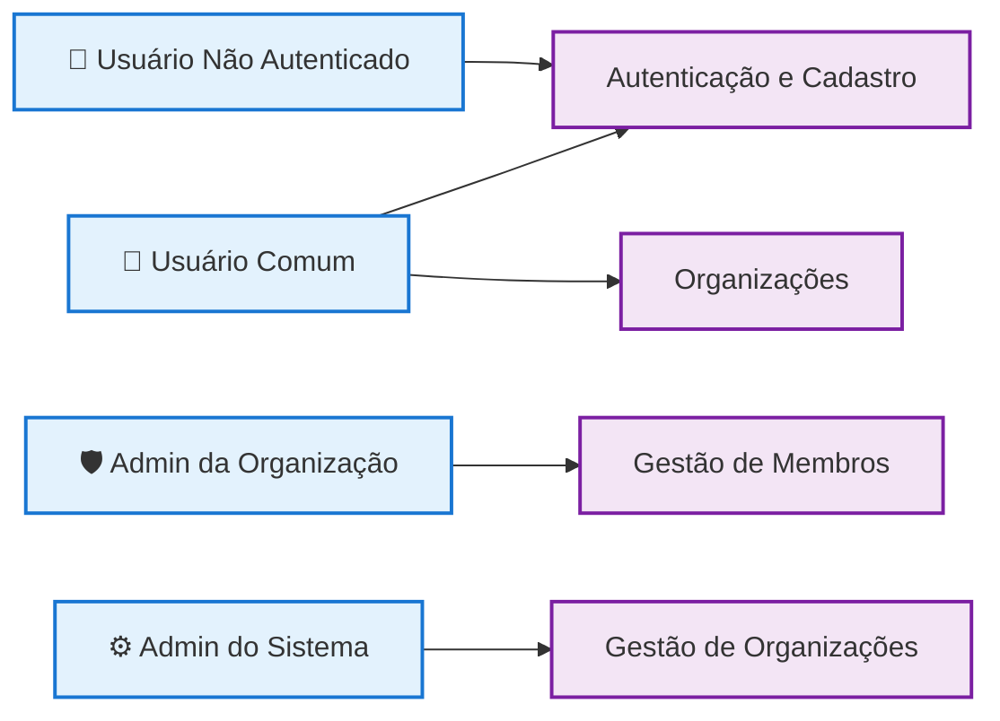
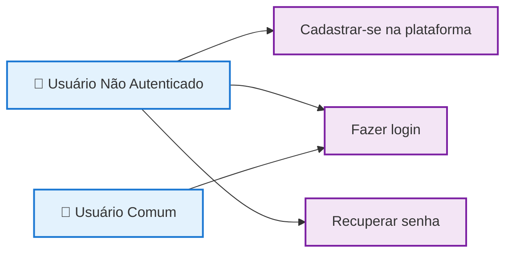
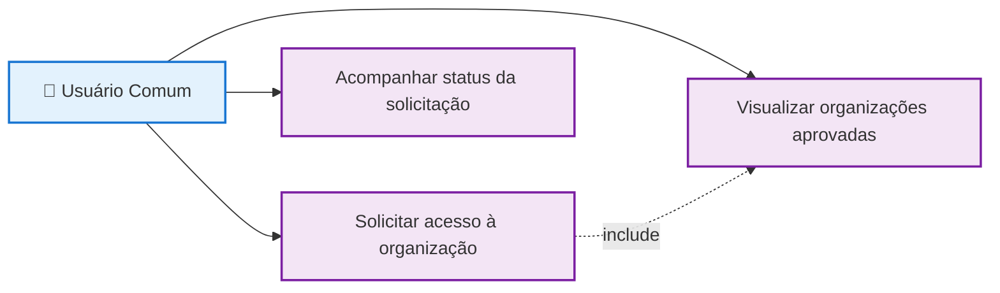
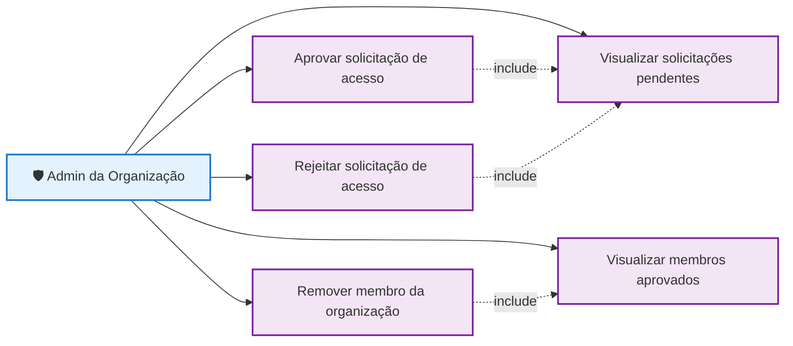
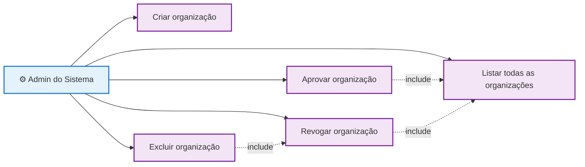

# Diagrama de Casos de Uso

## Visão Geral

---

## Autenticação e Cadastro

---

## Usuário - Organizações

---

## Admin da Organização - Gestão de Membros

---

## Admin do Sistema - Gestão de Organizações

