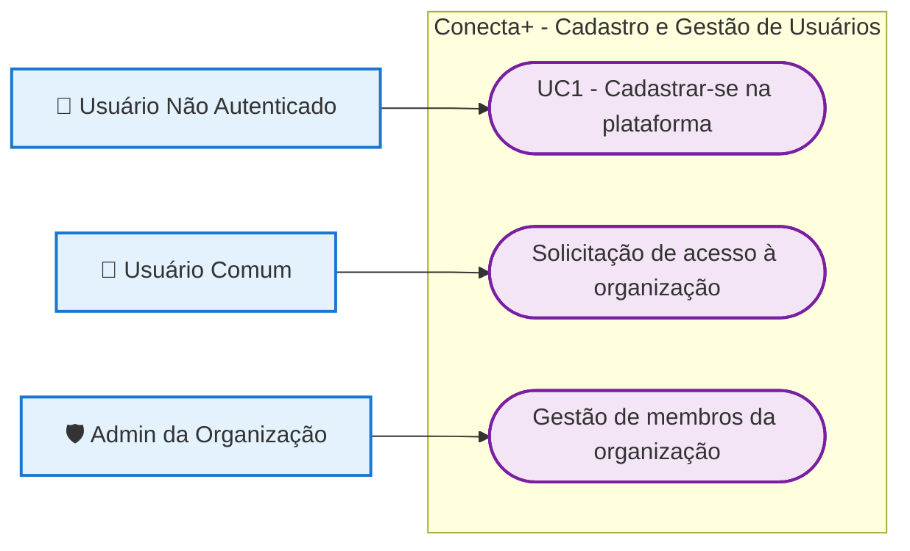
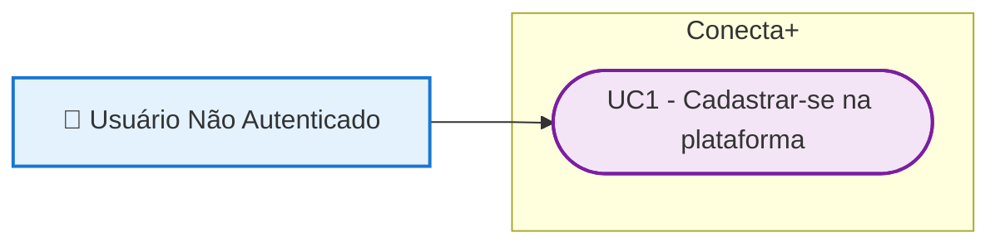
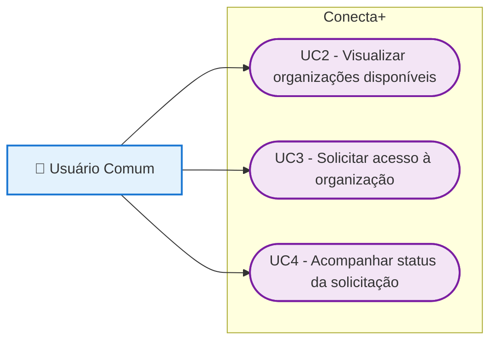
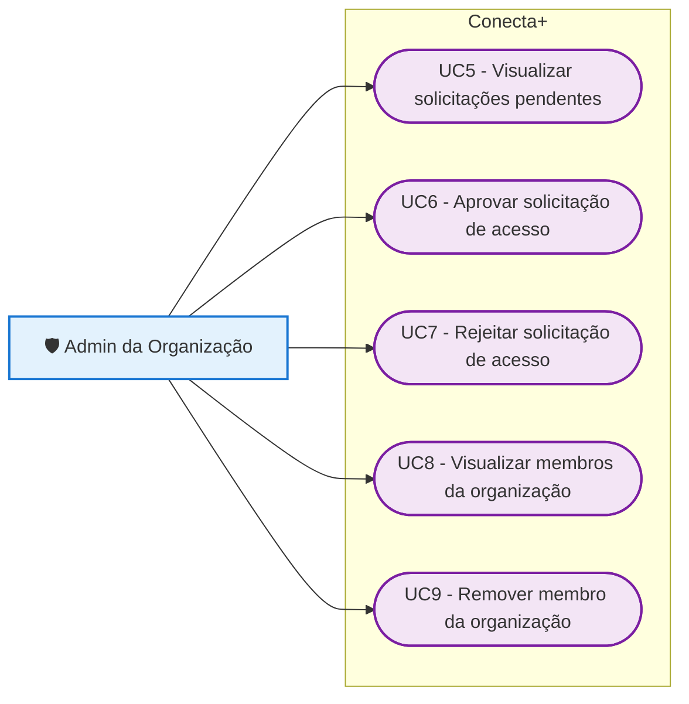

# Diagrama de Casos de Uso

> **Incremento:** Cadastro de Usuário, Solicitação de Acesso e Gestão de Membros.
>
> Este documento apresenta somente os casos de uso relacionados ao incremento solicitado.  
> A autenticação do usuário é considerada uma pré-condição para as funcionalidades que exigem acesso à plataforma.

---

## Visão Geral

---

## 1. Cadastro de Usuário

### Caso de uso

- **UC1 - Cadastrar-se na plataforma:** permite que uma pessoa ainda não cadastrada crie sua conta de usuário no Conecta+.

---

## 2. Solicitação de Acesso à Organização

### Casos de uso

- **UC2 - Visualizar organizações disponíveis:** permite ao usuário consultar organizações aprovadas disponíveis para solicitação de acesso.
- **UC3 - Solicitar acesso à organização:** permite ao usuário enviar uma solicitação para participar de uma organização.
- **UC4 - Acompanhar status da solicitação:** permite ao usuário verificar se sua solicitação está pendente, aprovada ou rejeitada.

---

## 3. Gestão de Membros da Organização

### Casos de uso

- **UC5 - Visualizar solicitações pendentes:** permite ao administrador visualizar usuários aguardando análise para ingresso na organização.
- **UC6 - Aprovar solicitação de acesso:** permite ao administrador autorizar o ingresso de um usuário na organização.
- **UC7 - Rejeitar solicitação de acesso:** permite ao administrador negar uma solicitação de ingresso.
- **UC8 - Visualizar membros da organização:** permite ao administrador consultar os usuários que possuem acesso aprovado à organização.
- **UC9 - Remover membro da organização:** permite ao administrador remover o acesso de um membro da organização.