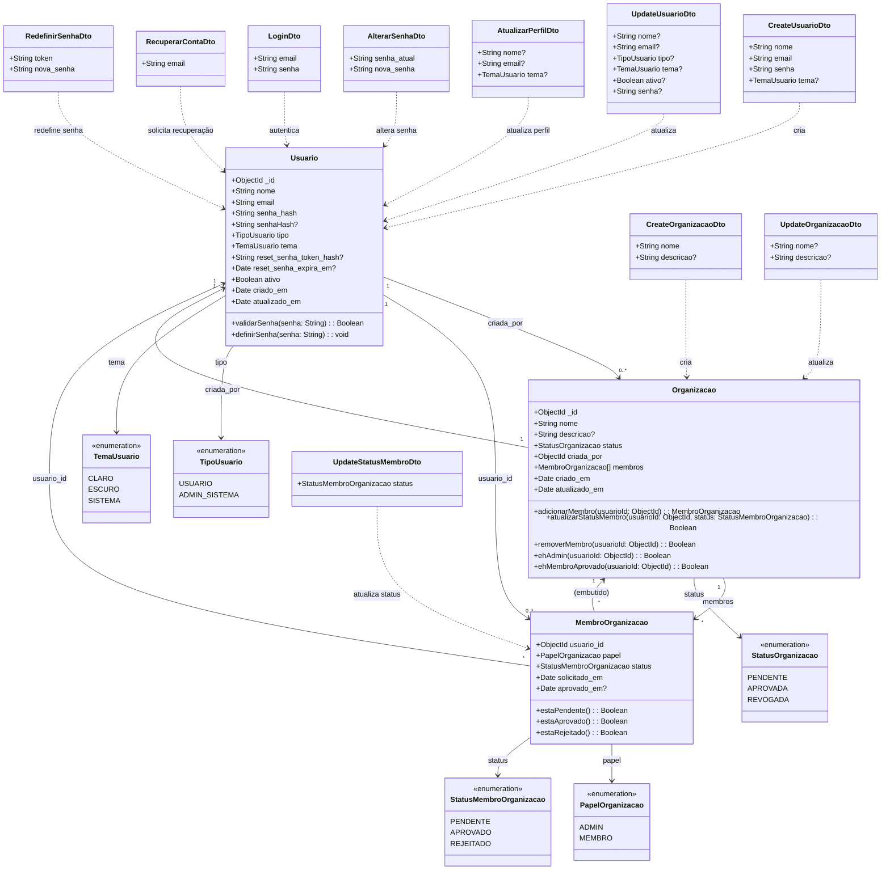

```mermaid
classDiagram
    %% ==================== ENUMS ====================
    class TipoUsuario {
        <<enumeration>>
        USUARIO
        ADMIN_SISTEMA
    }

    class TemaUsuario {
        <<enumeration>>
        CLARO
        ESCURO
        SISTEMA
    }

    class StatusOrganizacao {
        <<enumeration>>
        PENDENTE
        APROVADA
        REVOGADA
    }

    class PapelOrganizacao {
        <<enumeration>>
        ADMIN
        MEMBRO
    }

    class StatusMembroOrganizacao {
        <<enumeration>>
        PENDENTE
        APROVADO
        REJEITADO
    }

    %% ==================== CLASSES PRINCIPAIS ====================
    class Usuario {
        +ObjectId _id
        +String nome
        +String email
        +String senha_hash
        +String senhaHash?
        +TipoUsuario tipo
        +TemaUsuario tema
        +String reset_senha_token_hash?
        +Date reset_senha_expira_em?
        +Boolean ativo
        +Date criado_em
        +Date atualizado_em
        +validarSenha(senha: String): Boolean
        +definirSenha(senha: String): void
    }

    class Organizacao {
        +ObjectId _id
        +String nome
        +String descricao?
        +StatusOrganizacao status
        +ObjectId criada_por
        +MembroOrganizacao[] membros
        +Date criado_em
        +Date atualizado_em
        +adicionarMembro(usuarioId: ObjectId): MembroOrganizacao
        +atualizarStatusMembro(usuarioId: ObjectId, status: StatusMembroOrganizacao): Boolean
        +removerMembro(usuarioId: ObjectId): Boolean
        +ehAdmin(usuarioId: ObjectId): Boolean
        +ehMembroAprovado(usuarioId: ObjectId): Boolean
    }

    class MembroOrganizacao {
        +ObjectId usuario_id
        +PapelOrganizacao papel
        +StatusMembroOrganizacao status
        +Date solicitado_em
        +Date aprovado_em?
        +estaPendente(): Boolean
        +estaAprovado(): Boolean
        +estaRejeitado(): Boolean
    }

    %% ==================== DTOs (API Contracts) ====================
    class CreateUsuarioDto {
        +String nome
        +String email
        +String senha
        +TemaUsuario tema?
    }

    class UpdateUsuarioDto {
        +String nome?
        +String email?
        +TipoUsuario tipo?
        +TemaUsuario tema?
        +Boolean ativo?
        +String senha?
    }

    class AtualizarPerfilDto {
        +String nome?
        +String email?
        +TemaUsuario tema?
    }

    class AlterarSenhaDto {
        +String senha_atual
        +String nova_senha
    }

    class CreateOrganizacaoDto {
        +String nome
        +String descricao?
    }

    class UpdateOrganizacaoDto {
        +String nome?
        +String descricao?
    }

    class UpdateStatusMembroDto {
        +StatusMembroOrganizacao status
    }

    class LoginDto {
        +String email
        +String senha
    }

    class RecuperarContaDto {
        +String email
    }

    class RedefinirSenhaDto {
        +String token
        +String nova_senha
    }

    %% ==================== RELACIONAMENTOS ====================
    Usuario "1" --> "0..*" Organizacao : criada_por
    Usuario "1" --> "0..*" MembroOrganizacao : usuario_id
    Organizacao "1" --> "1" Usuario : criada_por
    Organizacao "1" --> "*" MembroOrganizacao : membros
    MembroOrganizacao "*" --> "1" Usuario : usuario_id
    MembroOrganizacao "*" --> "1" Organizacao : (embutido)

    %% DTOs relations
    CreateUsuarioDto ..> Usuario : cria
    UpdateUsuarioDto ..> Usuario : atualiza
    AtualizarPerfilDto ..> Usuario : atualiza perfil
    AlterarSenhaDto ..> Usuario : altera senha
    CreateOrganizacaoDto ..> Organizacao : cria
    UpdateOrganizacaoDto ..> Organizacao : atualiza
    UpdateStatusMembroDto ..> MembroOrganizacao : atualiza status
    LoginDto ..> Usuario : autentica
    RecuperarContaDto ..> Usuario : solicita recuperação
    RedefinirSenhaDto ..> Usuario : redefine senha

    %% Enum usage
    Usuario --> TipoUsuario : tipo
    Usuario --> TemaUsuario : tema
    Organizacao --> StatusOrganizacao : status
    MembroOrganizacao --> PapelOrganizacao : papel
    MembroOrganizacao --> StatusMembroOrganizacao : status
```