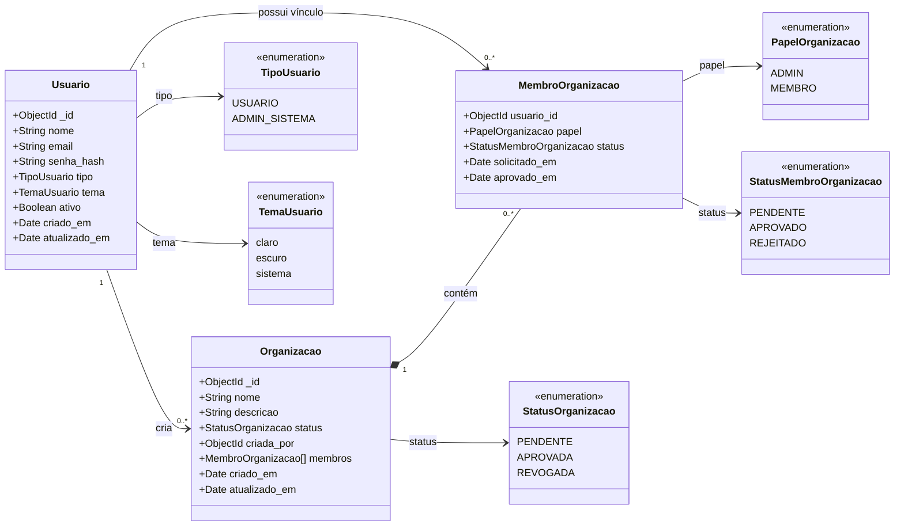

# Diagrama de Classes - Cadastro e Gestão de Usuários

> **Projeto:** Conecta+  
> **Incremento:** Cadastro de Usuário, Solicitação de Acesso e Gestão de Membros

## Observações

`MembroOrganizacao` representa um subdocumento embutido dentro de `Organizacao`. Cada vínculo associa um usuário a uma organização, armazenando seu papel, situação da solicitação e datas relacionadas.

O administrador de uma organização não é um tipo global de usuário. Ele é identificado pelo vínculo em `MembroOrganizacao`, quando possui:

- `papel = ADMIN`
- `status = APROVADO`

O campo `tipo` da classe `Usuario` representa apenas o perfil global da plataforma (`USUARIO` ou `ADMIN_SISTEMA`).