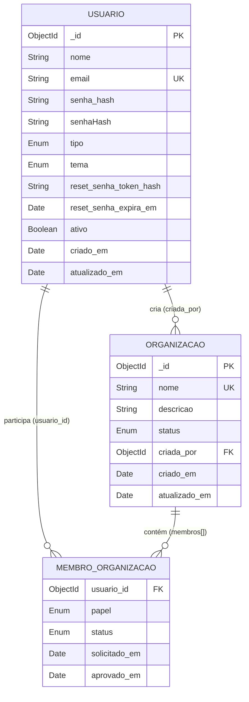

# Diagrama Relacional (Modelo Lógico) - Cadastro e Gestão de Usuários

> **Projeto:** Conecta+  
> **Banco:** MongoDB (NoSQL - Documentos)  
> **Abordagem:** Modelo lógico relacional para fins de documentação e entendimento das relações entre entidades

---

## Visão Geral do Modelo Entidade-Relacionamento



---

## Tabelas/Entidades Lógicas

### 1. `usuario` (Coleção `usuarios`)

| Coluna | Tipo | PK/FK/UK | Nulo | Default | Descrição |
|--------|------|----------|------|---------|-----------|
| `_id` | ObjectId | PK | Não | auto | Identificador único |
| `nome` | VARCHAR(100) | - | Não | - | Nome completo |
| `email` | VARCHAR(255) | UK | Não | - | Email único (case-insensitive) |
| `senha_hash` | VARCHAR(255) | - | Não | - | Hash bcrypt (cost 10) |
| `senha_hash_legado` | VARCHAR(255) | - | Sim | NULL | Compatibilidade contas antigas |
| `tipo` | ENUM('USUARIO','ADMIN_SISTEMA') | - | Não | 'USUARIO' | Tipo de usuário |
| `tema` | ENUM('CLARO','ESCURO','SISTEMA') | - | Não | 'SISTEMA' | Preferência de tema |
| `reset_senha_token_hash` | VARCHAR(64) | - | Sim | NULL | SHA-256 do token recuperação |
| `reset_senha_expira_em` | DATETIME | - | Sim | NULL | Expiração token (30 min) |
| `ativo` | BOOLEAN | - | Não | TRUE | Conta ativa/desativada |
| `criado_em` | DATETIME | - | Não | NOW() | Timestamp criação |
| `atualizado_em` | DATETIME | - | Não | NOW() | Timestamp atualização |

**Índices:**
- PK: `_id`
- UK: `email` (unique, collation pt strength 2)

---

### 2. `organizacao` (Coleção `organizacoes`)

| Coluna | Tipo | PK/FK/UK | Nulo | Default | Descrição |
|--------|------|----------|------|---------|-----------|
| `_id` | ObjectId | PK | Não | auto | Identificador único |
| `nome` | VARCHAR(100) | UK | Não | - | Nome único (case-insensitive) |
| `descricao` | VARCHAR(200) | - | Sim | NULL | Descrição opcional |
| `status` | ENUM('PENDENTE','APROVADA','REVOGADA') | - | Não | 'PENDENTE' | Status da organização |
| `criada_por` | ObjectId | FK → usuario._id | Não | - | Admin do sistema criador |
| `criado_em` | DATETIME | - | Não | NOW() | Timestamp criação |
| `atualizado_em` | DATETIME | - | Não | NOW() | Timestamp atualização |

**Índices:**
- PK: `_id`
- UK: `nome` (unique, collation pt strength 2)
- IDX: `status`, `criada_por`

---

### 3. `membro_organizacao` (Subdocumento Embutido em `organizacoes.membros`)

> **Nota:** No MongoDB, esta entidade é um **array embutido** (embedded array) dentro do documento `organizacao`. Para fins relacionais, é tratada como tabela fraca dependente de `organizacao`.

| Coluna | Tipo | PK/FK/UK | Nulo | Default | Descrição |
|--------|------|----------|------|---------|-----------|
| `usuario_id` | ObjectId | FK → usuario._id | Não | - | Usuário vinculado |
| `papel` | ENUM('ADMIN','MEMBRO') | - | Não | - | Papel na organização |
| `status` | ENUM('PENDENTE','APROVADO','REJEITADO') | - | Não | 'PENDENTE' | Status do vínculo |
| `solicitado_em` | DATETIME | - | Não | NOW() | Data da solicitação/adição |
| `aprovado_em` | DATETIME | - | Sim | NULL | Data da aprovação (só se APROVADO) |

**Chave Primária Composta (Lógica):** `(organizacao_id, usuario_id)`  
**Índices Lógicos:** `usuario_id`, `status`, `papel`

---

## Relacionamentos

### 1. `usuario` 1:N `organizacao` (Criação)
| Aspecto | Detalhe |
|---------|---------|
| **Cardinalidade** | Um `ADMIN_SISTEMA` cria N organizações |
| **FK** | `organizacao.criada_por` → `usuario._id` |
| **Regra** | Apenas usuários com `tipo = ADMIN_SISTEMA` |
| **Ação em cascata** | Nenhuma (organização persiste se criador desativado) |

### 2. `usuario` N:M `organizacao` (Participação via `membro_organizacao`)
| Aspecto | Detalhe |
|---------|---------|
| **Cardinalidade** | Usuário participa de N organizações; Organização tem N membros |
| **Tabela associativa** | `membro_organizacao` (embutido em `organizacao`) |
| **FKs** | `membro_organizacao.usuario_id` → `usuario._id`<br>`membro_organizacao` pertence a `organizacao` (pai) |
| **Atributos do vínculo** | `papel`, `status`, `solicitado_em`, `aprovado_em` |
| **Unicidade** | Um usuário só pode ter **um** vínculo por organização |

---

## Regras de Integridade Referencial (Implementadas no Código)

| Regra | Entidade | Implementação |
|-------|----------|---------------|
| **RI-01** | `organizacao.criada_por` | Valida existência do usuário no `OrganizacoesService.criar` |
| **RI-02** | `membro_organizacao.usuario_id` | Valida usuário existe e `ativo: true` no `adicionarMembro` |
| **RI-03** | Unicidade vínculo | `adicionarMembro` usa `updateOne` com filtro `$ne` + `arrayFilters` atômico |
| **RI-04** | Admin da org | `exigirAdministrador` valida: `papel=ADMIN` + `status=APROVADO` na org |
| **RI-05** | Org aprovada para gestão | `exigirOrganizacaoAprovada` bloqueia se `status != APROVADA` |
| **RI-06** | Não remover admin org | `removerMembro` bloqueia se `papel=ADMIN` |
| **RI-07** | Exclusão org só se revogada | `remover` filtra `status=REVOGADA` no `deleteOne` |
| **RI-08** | Cascata comissões | `removerMembro` faz `$pull` em `comissoes.membros` |

---

## Mapeamento MongoDB → Relacional (Para Entendimento)

| Conceito Relacional | Implementação MongoDB |
|---------------------|----------------------|
| Tabela `usuario` | Coleção `usuarios` |
| Tabela `organizacao` | Coleção `organizacoes` |
| Tabela `membro_organizacao` | Array embutido `organizacoes.membros[]` |
| FK `organizacao.criada_por` | Campo `ObjectId` ref `Usuario` (populate) |
| FK `membro.usuario_id` | Campo `ObjectId` ref `Usuario` (populate) |
| PK Composta `(org_id, user_id)` | Unicidade garantida por `arrayFilters` + `$ne` no push |
| JOIN | `$lookup` / `populate()` no Mongoose |
| Transação | Operações atômicas em documento único (`updateOne` com `arrayFilters`) |

---

## Diagrama de Dependências (DDL Lógico Equivalente)

```sql
-- Tabela USUARIO
CREATE TABLE usuario (
    _id           OBJECTID PRIMARY KEY,
    nome          VARCHAR(100) NOT NULL,
    email         VARCHAR(255) NOT NULL UNIQUE,
    senha_hash    VARCHAR(255) NOT NULL,
    senha_hash_legado VARCHAR(255) NULL,
    tipo          ENUM('USUARIO','ADMIN_SISTEMA') NOT NULL DEFAULT 'USUARIO',
    tema          ENUM('CLARO','ESCURO','SISTEMA') NOT NULL DEFAULT 'SISTEMA',
    reset_senha_token_hash VARCHAR(64) NULL,
    reset_senha_expira_em  DATETIME NULL,
    ativo         BOOLEAN NOT NULL DEFAULT TRUE,
    criado_em     DATETIME NOT NULL DEFAULT CURRENT_TIMESTAMP,
    atualizado_em DATETIME NOT NULL DEFAULT CURRENT_TIMESTAMP
);

-- Tabela ORGANIZACAO
CREATE TABLE organizacao (
    _id           OBJECTID PRIMARY KEY,
    nome          VARCHAR(100) NOT NULL UNIQUE,
    descricao     VARCHAR(200) NULL,
    status        ENUM('PENDENTE','APROVADA','REVOGADA') NOT NULL DEFAULT 'PENDENTE',
    criada_por    OBJECTID NOT NULL REFERENCES usuario(_id),
    criado_em     DATETIME NOT NULL DEFAULT CURRENT_TIMESTAMP,
    atualizado_em DATETIME NOT NULL DEFAULT CURRENT_TIMESTAMP
);

-- Tabela Associativa MEMBRO_ORGANIZACAO (Embutida no MongoDB)
CREATE TABLE membro_organizacao (
    organizacao_id OBJECTID NOT NULL REFERENCES organizacao(_id) ON DELETE CASCADE,
    usuario_id     OBJECTID NOT NULL REFERENCES usuario(_id),
    papel          ENUM('ADMIN','MEMBRO') NOT NULL,
    status         ENUM('PENDENTE','APROVADO','REJEITADO') NOT NULL DEFAULT 'PENDENTE',
    solicitado_em  DATETIME NOT NULL DEFAULT CURRENT_TIMESTAMP,
    aprovado_em    DATETIME NULL,
    PRIMARY KEY (organizacao_id, usuario_id)
);

-- Índices Adicionais
CREATE INDEX idx_usuario_email ON usuario(email) WITH (collation='pt', strength=2);
CREATE INDEX idx_organizacao_nome ON organizacao(nome) WITH (collation='pt', strength=2);
CREATE INDEX idx_organizacao_status ON organizacao(status);
CREATE INDEX idx_membro_usuario ON membro_organizacao(usuario_id);
CREATE INDEX idx_membro_status ON membro_organizacao(status);
```

---

## Diferenças Importantes: Relacional vs MongoDB Atual

| Aspecto | Modelo Relacional Tradicional | MongoDB Atual (Conecta+) |
|---------|-------------------------------|--------------------------|
| `membro_organizacao` | Tabela separada com PK composta | **Array embutido** em `organizacao` |
| Transações multi-tabela | ACID com `BEGIN/COMMIT` | **Atomicidade por documento** (`updateOne` + `arrayFilters`) |
| JOINs | `INNER/LEFT JOIN` | `populate()` / `$lookup` (lazy/eager) |
| Cascata FK | `ON DELETE CASCADE` | **Código imperativo** no service (`removerMembro` → `updateMany` comissões) |
| Unicidade vínculo | `UNIQUE (org_id, user_id)` | **Lógica atômica** no `adicionarMembro` (filtro `$ne`) |
| Schema rígido | `ALTER TABLE` | **Schema flexível** (campos opcionais, evolução natural) |

---

## Consultas Típicas (Equivalente SQL → MongoDB)

| Operação | SQL | MongoDB (Mongoose) |
|----------|-----|-------------------|
| Org + criador | `SELECT * FROM organizacao JOIN usuario ON criada_por = _id` | `Organizacao.find().populate('criada_por')` |
| Membros da org | `SELECT * FROM membro_organizacao JOIN usuario ON usuario_id = _id WHERE organizacao_id = ?` | `Organizacao.findById(id).populate('membros.usuario_id')` |
| Orgs do usuário | `SELECT o.* FROM organizacao o JOIN membro_organizacao m ON o._id = m.organizacao_id WHERE m.usuario_id = ?` | `Organizacao.find({ 'membros.usuario_id': userId })` |
| Solicitações pendentes | `SELECT * FROM membro_organizacao WHERE organizacao_id = ? AND status = 'PENDENTE'` | `org.membros.filter(m => m.status === 'PENDENTE')` (após populate) |
| Aprovar membro | `UPDATE membro_organizacao SET status='APROVADO', aprovado_em=NOW() WHERE organizacao_id=? AND usuario_id=? AND status='PENDENTE'` | `updateOne` com `arrayFilters` atômico |

---

*Documento gerado para fins de documentação arquitetural. O modelo físico real é NoSQL (MongoDB) com documentos embutidos e validações no código da aplicação (NestJS/Mongoose).*