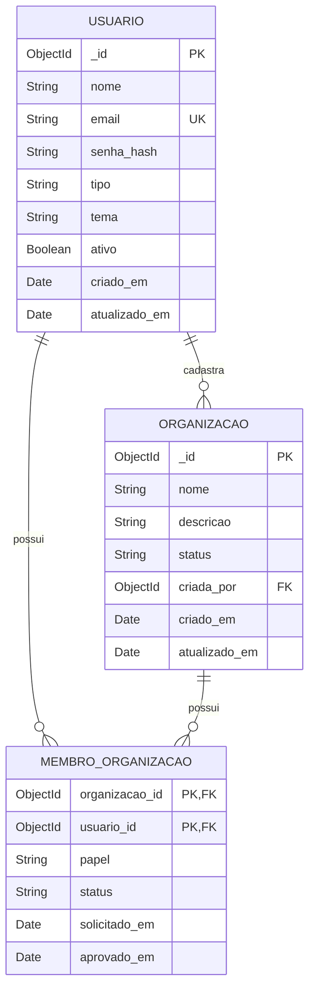

# Diagrama Relacional - Cadastro e Gestão de Usuários

> **Projeto:** Conecta+  
> **Incremento:** Cadastro de Usuário, Solicitação de Acesso e Gestão de Membros  
> **Banco de Dados:** MongoDB  
> **Abordagem:** Modelo lógico relacional utilizado para representar as relações entre os dados do incremento.

---

## Modelo Relacional



---

## Relacionamentos

### `USUARIO` → `ORGANIZACAO`

Um usuário pode estar relacionado ao cadastro de nenhuma ou várias organizações.

```text
USUARIO 1 -------- 0..* ORGANIZACAO
```

A referência é representada por:

```text
ORGANIZACAO.criada_por → USUARIO._id
```

---

### `USUARIO` → `MEMBRO_ORGANIZACAO`

Um usuário pode possuir vínculos com nenhuma ou várias organizações.

```text
USUARIO 1 -------- 0..* MEMBRO_ORGANIZACAO
```

A referência é representada por:

```text
MEMBRO_ORGANIZACAO.usuario_id → USUARIO._id
```

---

### `ORGANIZACAO` → `MEMBRO_ORGANIZACAO`

Uma organização pode possuir nenhum ou vários membros.

```text
ORGANIZACAO 1 -------- 0..* MEMBRO_ORGANIZACAO
```

A referência lógica é representada por:

```text
MEMBRO_ORGANIZACAO.organizacao_id → ORGANIZACAO._id
```

---

## Observação sobre o MongoDB

O modelo acima representa uma **visão relacional lógica** dos dados.

Na implementação real do Conecta+, `MEMBRO_ORGANIZACAO` não é uma coleção independente. Os vínculos são armazenados como subdocumentos dentro do array:

```text
organizacoes.membros[]
```

Portanto, no MongoDB a estrutura física é semelhante a:

```text
Organizacao
│
├── _id
├── nome
├── status
├── criada_por
│
└── membros[]
    ├── usuario_id
    ├── papel
    ├── status
    ├── solicitado_em
    └── aprovado_em
```

No modelo relacional, o campo `organizacao_id` é incluído em `MEMBRO_ORGANIZACAO` para representar explicitamente a relação com a organização.

A combinação:

```text
(organizacao_id, usuario_id)
```

representa a chave composta lógica do vínculo, garantindo conceitualmente que um usuário possua apenas um vínculo por organização.