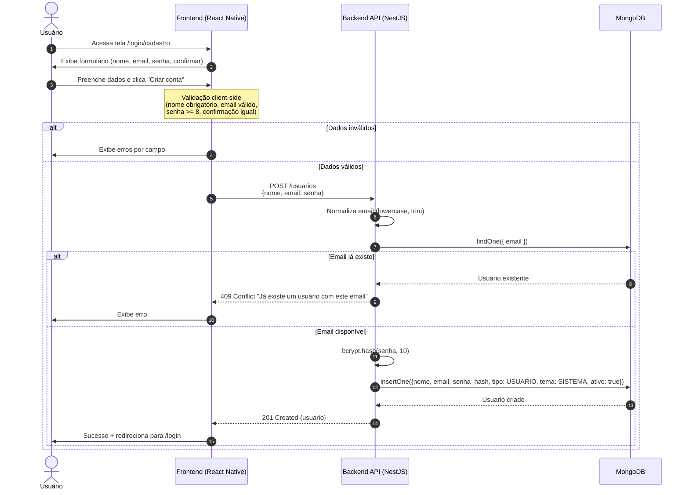
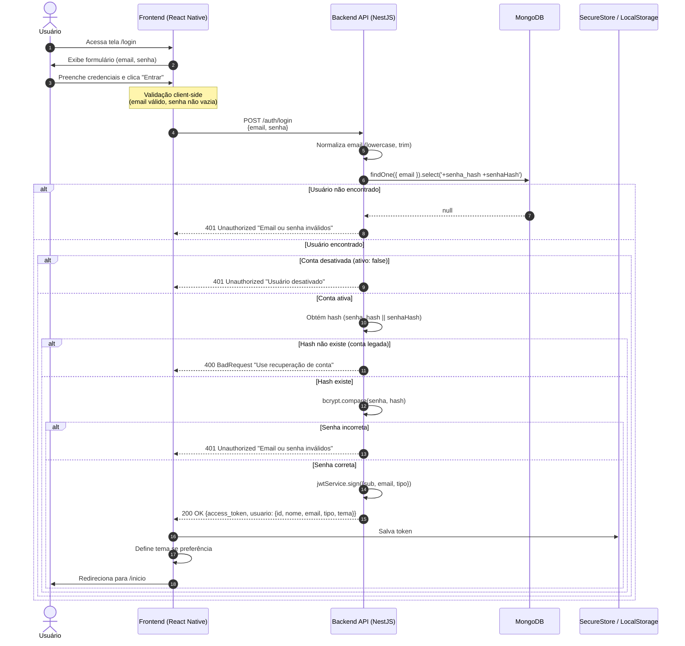
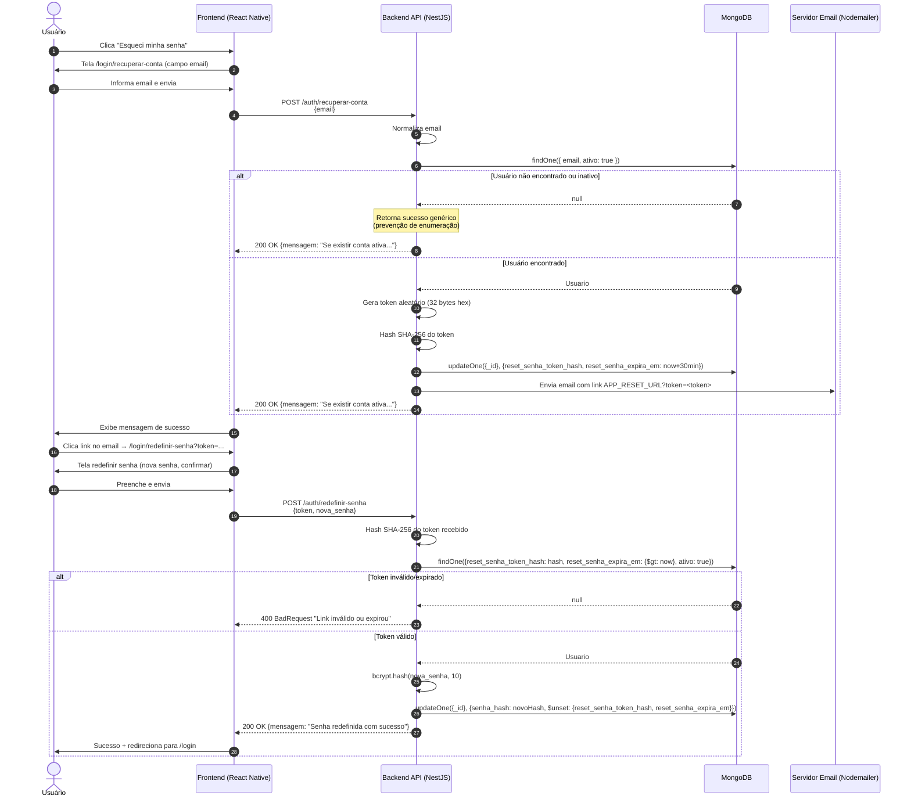
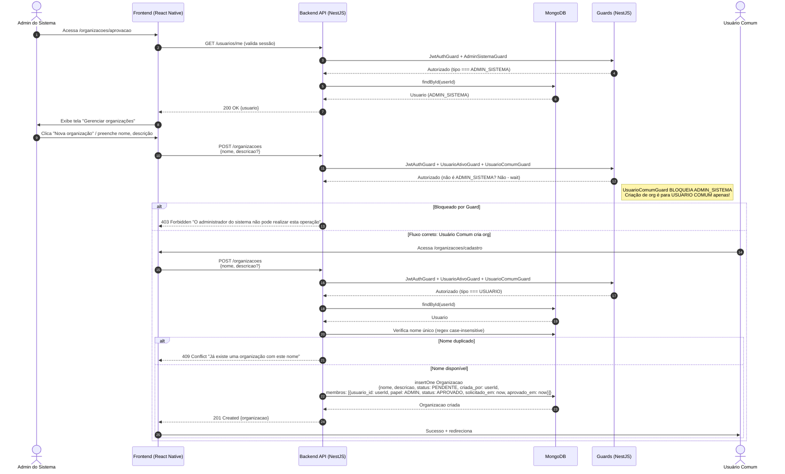
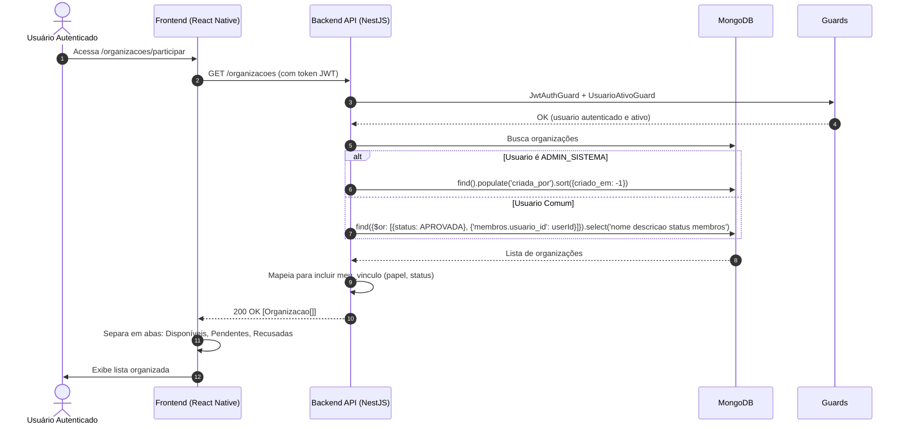
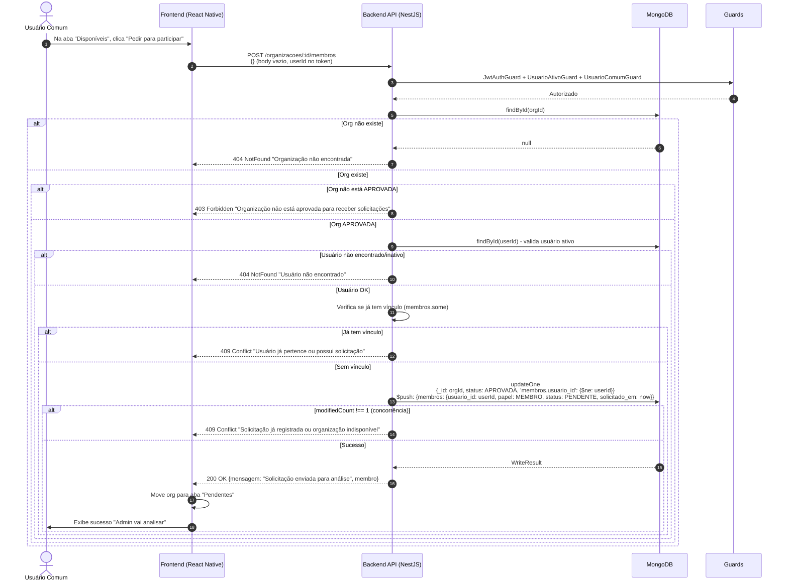
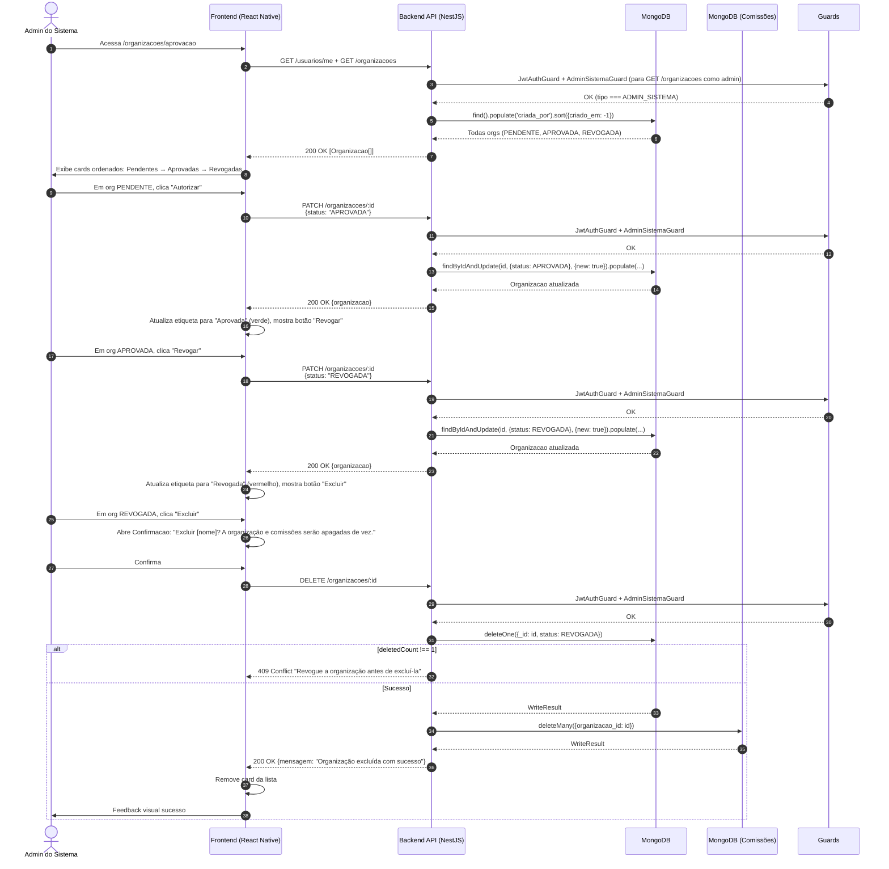

# Diagramas de Sequência - Cadastro e Gestão de Usuários

> **Projeto:** Conecta+  
> **Incremento:** Cadastro de Usuário, Solicitação de Acesso e Gestão de Membros  
> **Formato:** Mermaid (sequenceDiagram)  
> **Versão:** 1.0

---

## Índice de Diagramas

1. [Cadastro de Usuário](#1-cadastro-de-usuário)
2. [Login e Autenticação](#2-login-e-autenticação)
3. [Recuperação de Senha](#3-recuperação-de-senha)
4. [Criação de Organização (Admin Sistema)](#4-criação-de-organização-admin-sistema)
5. [Listagem de Organizações](#5-listagem-de-organizações)
6. [Solicitação de Acesso a Organização](#6-solicitação-de-acesso-a-organização)
7. [Aprovação de Solicitação (Admin Org)](#7-aprovação-de-solicitação-admin-org)
8. [Rejeição de Solicitação (Admin Org)](#8-rejeição-de-solicitação-admin-org)
9. [Remoção de Membro (Admin Org)](#9-remoção-de-membro-admin-org)
10. [Aprovação/Revogação/Exclusão de Organização (Admin Sistema)](#10-aprovaçãorevogaçãoexclusão-de-organização-admin-sistema)

---

## 1. Cadastro de Usuário



---

## 2. Login e Autenticação



---

## 3. Recuperação de Senha



---

## 4. Criação de Organização (Admin Sistema)



---

## 5. Listagem de Organizações



---

## 6. Solicitação de Acesso a Organização



---

## 7. Aprovação de Solicitação (Admin Org)

```mermaid
sequenceDiagram
    autonumber
    actor AdminOrg as Admin da Organização
    participant Frontend as Frontend (React Native)
    participant API as Backend API (NestJS)
    participant DB as MongoDB
    participant Guards as Guards

    AdminOrg->>Frontend: Acessa /organizacoes/membros?organizacao_id=...
    Frontend->>API: GET /organizacoes (lista orgs onde é ADMIN aprovado)
    API->>Guards: JwtAuthGuard + UsuarioAtivoGuard
    Guards-->>API: OK
    API->>DB: find({status: APROVADA, 'membros.usuario_id': userId, 'membros.papel': ADMIN, 'membros.status': APROVADO})
    DB-->>API: Orgs administradas
    Frontend->>AdminOrg: Lista orgs para escolher
    
    AdminOrg->>Frontend: Seleciona org → carrega detalhes
    Frontend->>API: GET /organizacoes/:id
    API->>Guards: JwtAuthGuard + UsuarioAtivoGuard
    API->>API: exigirAdministrador(orgId, solicitanteId)
    API->>DB: findById(orgId).populate('membros.usuario_id')
    DB-->>API: Organizacao com membros populados
    API-->>Frontend: 200 OK {organizacao, membros[]}
    Frontend->>AdminOrg: Exibe seção "Solicitações pendentes" com botões Aprovar/Rejeitar
    
    AdminOrg->>Frontend: Clica "Aprovar" em membro PENDENTE
    Frontend->>API: PATCH /organizacoes/:id/membros/:usuarioId<br/>{status: "APROVADO"}
    API->>Guards: JwtAuthGuard + UsuarioAtivoGuard + UsuarioComumGuard
    Guards-->>API: OK
    API->>API: exigirAdministrador(orgId, solicitanteId)
    API->>API: exigirOrganizacaoAprovada(organizacao)
    API->>API: Valida status alvo === PENDENTE
    API->>API: Valida statusDto === APROVADO ou REJEITADO
    
    alt Validações falham
        API-->>Frontend: 400/403/409 erro correspondente
    else Validações OK
        API->>DB: updateOne<br/>{_id: orgId, status: APROVADA,<br/>$and: [{membros: {$elemMatch: {usuario_id: solicitanteId, papel: ADMIN, status: APROVADO}}},<br/>{membros: {$elemMatch: {usuario_id: alvoId, status: PENDENTE}}}]},
        {$set: {'membros.$[alvo].status': 'APROVADO', 'membros.$[alvo].aprovado_em': now},<br/>arrayFilters: [{'alvo.usuario_id': alvoId, 'alvo.status': 'PENDENTE'}]}
        
        alt modifiedCount !== 1
            API-->>Frontend: 409 Conflict "Solicitação ou permissões alteradas. Atualize a lista"
        else Sucesso
            DB-->>API: WriteResult
            API-->>Frontend: 200 OK {mensagem: "Solicitação analisada", usuario_id, status: APROVADO}
            Frontend->>Frontend: Move membro para "Membros aprovados", etiqueta "Aprovado"
            Frontend->>AdminOrg: Feedback visual sucesso
        end
    end
```

---

## 8. Rejeição de Solicitação (Admin Org)

```mermaid
sequenceDiagram
    autonumber
    actor AdminOrg as Admin da Organização
    participant Frontend as Frontend (React Native)
    participant API as Backend API (NestJS)
    participant DB as MongoDB
    participant Guards as Guards

    AdminOrg->>Frontend: Na tela de membros, clica "Rejeitar" em solicitação PENDENTE
    Frontend->>API: PATCH /organizacoes/:id/membros/:usuarioId<br/>{status: "REJEITADO"}
    API->>Guards: JwtAuthGuard + UsuarioAtivoGuard + UsuarioComumGuard
    Guards-->>API: OK
    API->>API: exigirAdministrador(orgId, solicitanteId)
    API->>API: exigirOrganizacaoAprovada(organizacao)
    API->>API: Valida status alvo === PENDENTE
    API->>API: Valida statusDto === REJEITADO
    
    alt Validações falham
        API-->>Frontend: 400/403/409 erro
    else Validações OK
        API->>DB: updateOne<br/>{_id: orgId, status: APROVADA,<br/>$and: [{membros: {$elemMatch: {usuario_id: solicitanteId, papel: ADMIN, status: APROVADO}}},<br/>{membros: {$elemMatch: {usuario_id: alvoId, status: PENDENTE}}}]},
        {$set: {'membros.$[alvo].status': 'REJEITADO'},<br/>$unset: {'membros.$[alvo].aprovado_em': ''},<br/>arrayFilters: [{'alvo.usuario_id': alvoId, 'alvo.status': 'PENDENTE'}]}
        
        alt modifiedCount !== 1
            API-->>Frontend: 409 Conflict "Solicitação ou permissões alteradas"
        else Sucesso
            DB-->>API: WriteResult
            API-->>Frontend: 200 OK {mensagem: "Solicitação analisada", usuario_id, status: REJEITADO}
            Frontend->>Frontend: Move membro para aba "Recusadas", etiqueta "Solicitação recusada"
            Frontend->>AdminOrg: Feedback visual sucesso
        end
    end
```

---

## 9. Remoção de Membro (Admin Org)

```mermaid
sequenceDiagram
    autonumber
    actor AdminOrg as Admin da Organização
    participant Frontend as Frontend (React Native)
    participant API as Backend API (NestJS)
    participant DB as MongoDB
    participant ComissaoDB as MongoDB (Comissões)

    AdminOrg->>Frontend: Na seção "Membros aprovados", clica "Remover acesso" em MEMBRO
    Frontend->>Frontend: Abre Confirmacao modal com aviso
    Note over Frontend: "A pessoa também sairá das comissões.<br/>Conta e vínculos com outras orgs preservados."
    AdminOrg->>Frontend: Confirma remoção
    Frontend->>API: DELETE /organizacoes/:id/membros/:usuarioId
    API->>Guards: JwtAuthGuard + UsuarioAtivoGuard + UsuarioComumGuard
    Guards-->>API: OK
    API->>API: exigirAdministrador(orgId, solicitanteId)
    API->>API: exigirOrganizacaoAprovada(organizacao)
    API->>API: Busca membro alvo
    
    alt Membro é ADMIN
        API-->>Frontend: 403 Forbidden "Não é permitido remover administradores"
    else Membro não é APROVADO
        API-->>Frontend: 409 Conflict "Apenas membros aprovados podem ser removidos"
    else Membro é MEMBRO APROVADO
        API->>DB: updateOne<br/>{_id: orgId, status: APROVADA,<br/>$and: [{membros: {$elemMatch: {usuario_id: solicitanteId, papel: ADMIN, status: APROVADO}}},<br/>{membros: {$elemMatch: {usuario_id: alvoId, papel: MEMBRO, status: APROVADO}}}]},
        {$pull: {membros: {usuario_id: alvoId}}}
        
        alt modifiedCount !== 1
            API-->>Frontend: 409 Conflict "Vínculo ou permissões mudaram"
        else Sucesso remoção da org
            DB-->>API: WriteResult
            API->>ComissaoDB: updateMany<br/>{organizacao_id: orgId},<br/>{$pull: {membros: {usuario_id: alvoId}}}
            ComissaoDB-->>API: WriteResult
            API-->>Frontend: 200 OK {mensagem: "Acesso à organização removido com sucesso"}
            Frontend->>Frontend: Remove card da lista
            Frontend->>AdminOrg: Exibe sucesso "Acesso removido"
        end
    end
```

---

## 10. Aprovação/Revogação/Exclusão de Organização (Admin Sistema)



---

## Resumo de Endpoints e Guards

| Fluxo | Método | Endpoint | Guards | Service Method |
|-------|--------|----------|--------|----------------|
| Cadastro | POST | `/usuarios` | - | `UsuarioService.criar` |
| Login | POST | `/auth/login` | - | `AuthService.login` |
| Recuperar senha | POST | `/auth/recuperar-conta` | - | `AuthService.solicitarRecuperacao` |
| Redefinir senha | POST | `/auth/redefinir-senha` | - | `AuthService.redefinirSenha` |
| Criar org | POST | `/organizacoes` | JwtAuthGuard, UsuarioAtivoGuard, **UsuarioComumGuard** | `OrganizacoesService.criar` |
| Listar orgs | GET | `/organizacoes` | JwtAuthGuard, UsuarioAtivoGuard | `OrganizacoesService.listar` |
| Detalhes org | GET | `/organizacoes/:id` | JwtAuthGuard, UsuarioAtivoGuard | `OrganizacoesService.buscarPorId` (exige admin) |
| Solicitar acesso | POST | `/organizacoes/:id/membros` | JwtAuthGuard, UsuarioAtivoGuard, **UsuarioComumGuard** | `OrganizacoesService.adicionarMembro` |
| Aprovar/Rejeitar | PATCH | `/organizacoes/:id/membros/:usuarioId` | JwtAuthGuard, UsuarioAtivoGuard, **UsuarioComumGuard** | `OrganizacoesService.atualizarStatusMembro` (exige admin da org) |
| Remover membro | DELETE | `/organizacoes/:id/membros/:usuarioId` | JwtAuthGuard, UsuarioAtivoGuard, **UsuarioComumGuard** | `OrganizacoesService.removerMembro` (exige admin da org) |
| Atualizar org | PATCH | `/organizacoes/:id` | JwtAuthGuard, **AdminSistemaGuard** | `OrganizacoesService.atualizar` |
| Excluir org | DELETE | `/organizacoes/:id` | JwtAuthGuard, **AdminSistemaGuard** | `OrganizacoesService.remover` |

---

## Legenda de Cores (para referência visual)

| Cor | Significado |
|-----|-------------|
| 🟢 Verde | Sucesso / Fluxo principal |
| 🔴 Vermelho | Erro / Bloqueio / Exceção |
| 🟡 Amarelo | Validação / Decisão / Alternativa |
| 🔵 Azul | Operação de banco de dados |
| 🟣 Roxo | Guards / Autorização |
| ⚪ Cinza | Notas / Comentários |

---

*Diagramas gerados a partir da análise do código-fonte: Controllers, Services, Guards, Schemas e Frontend (React Native/Expo Router).*