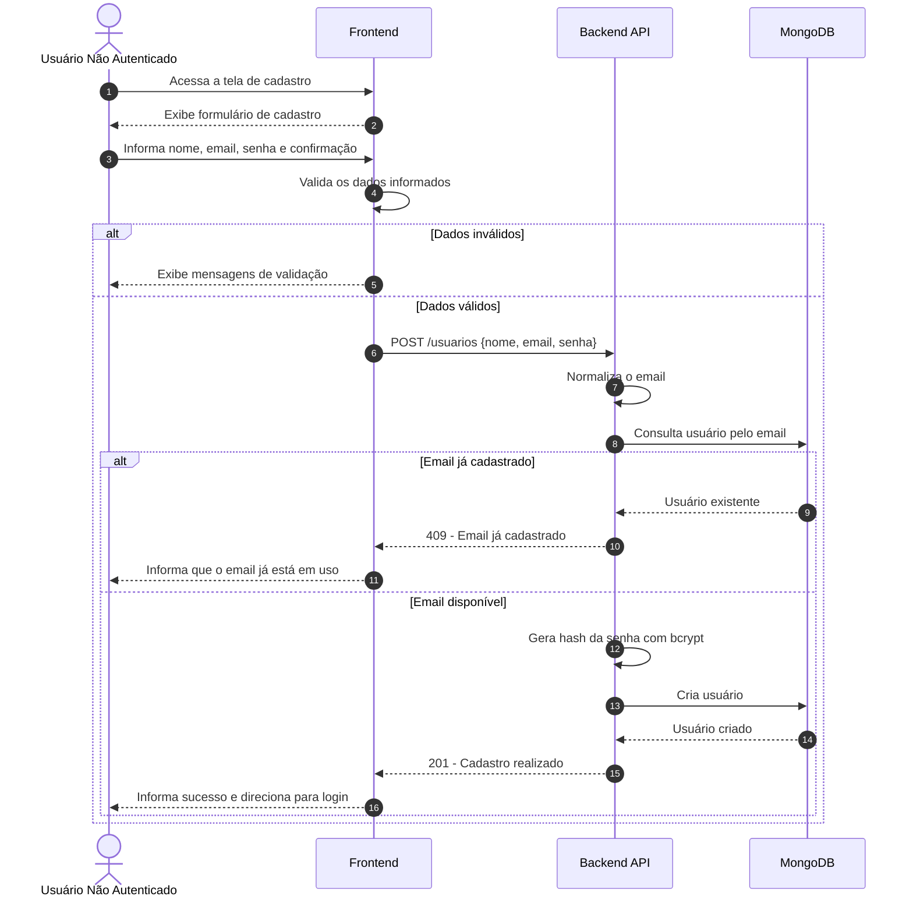
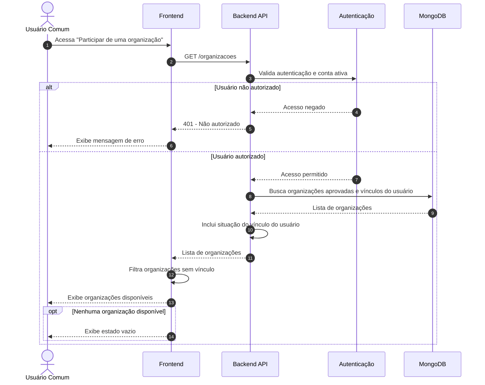
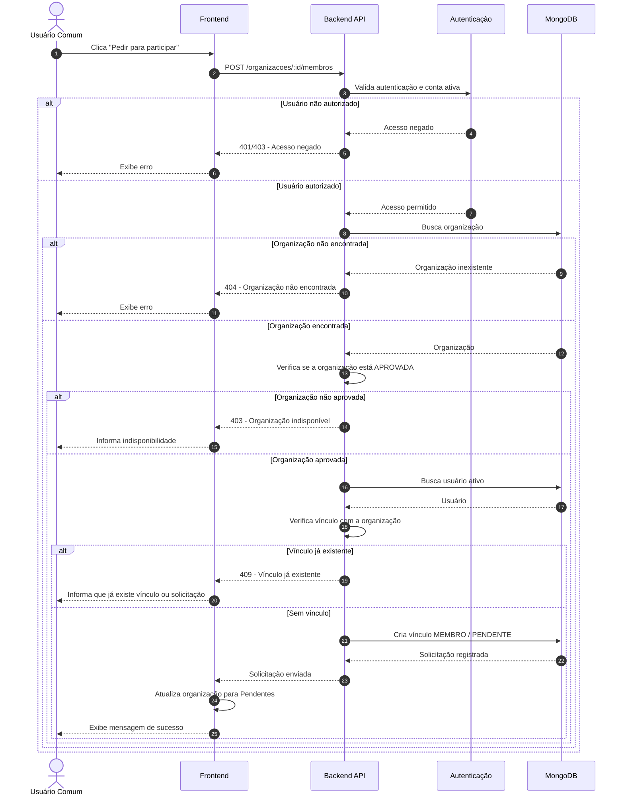
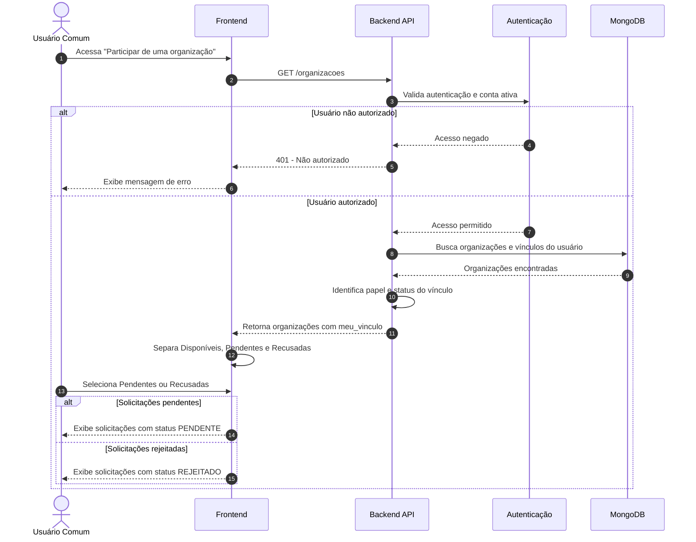
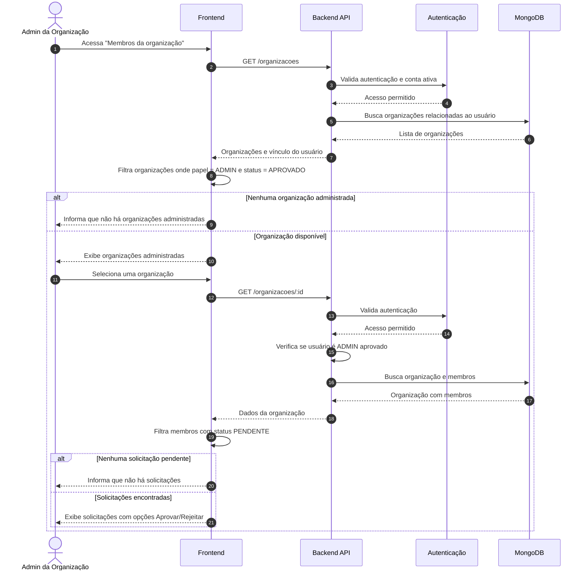
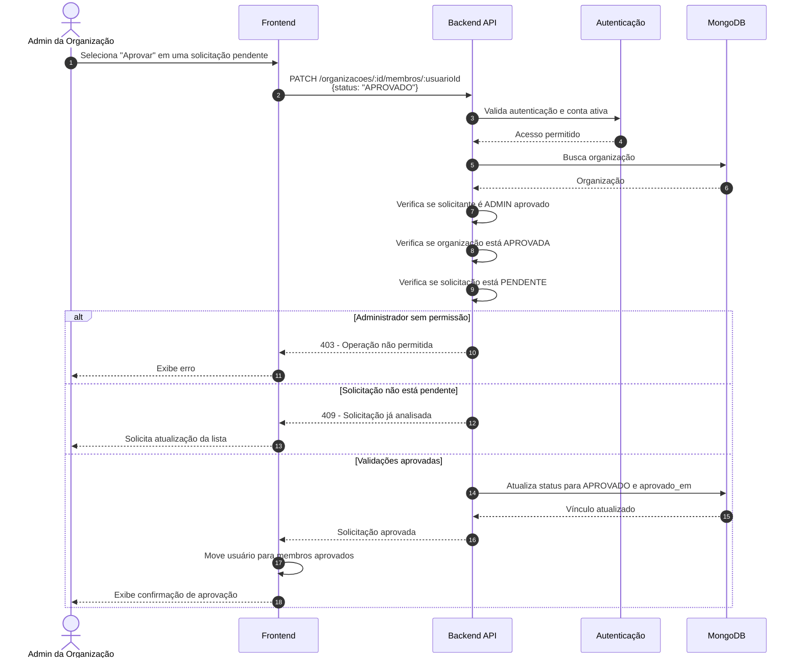
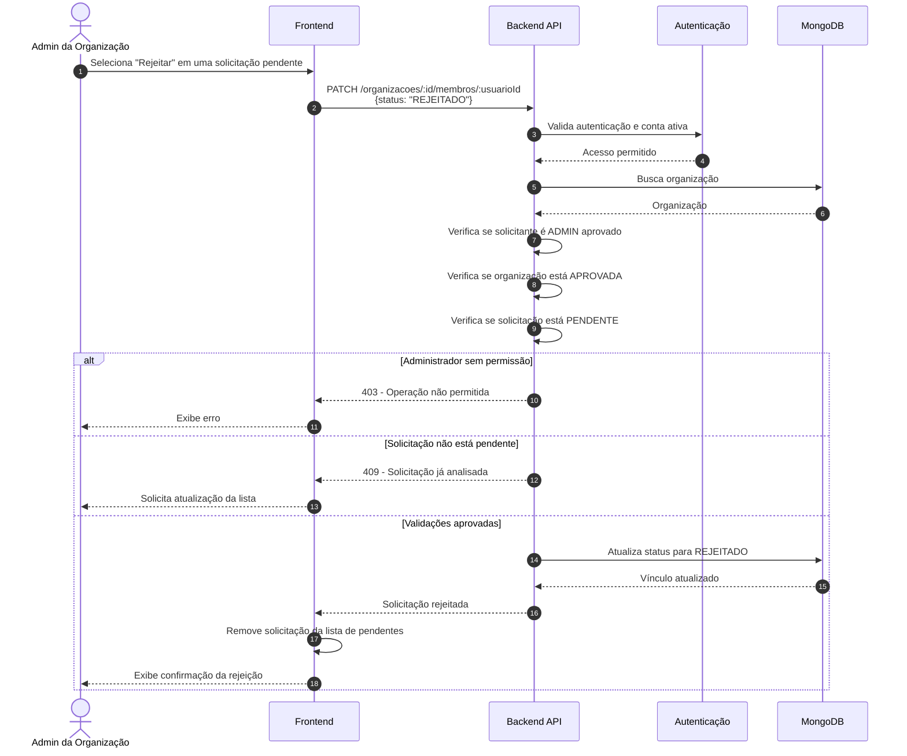
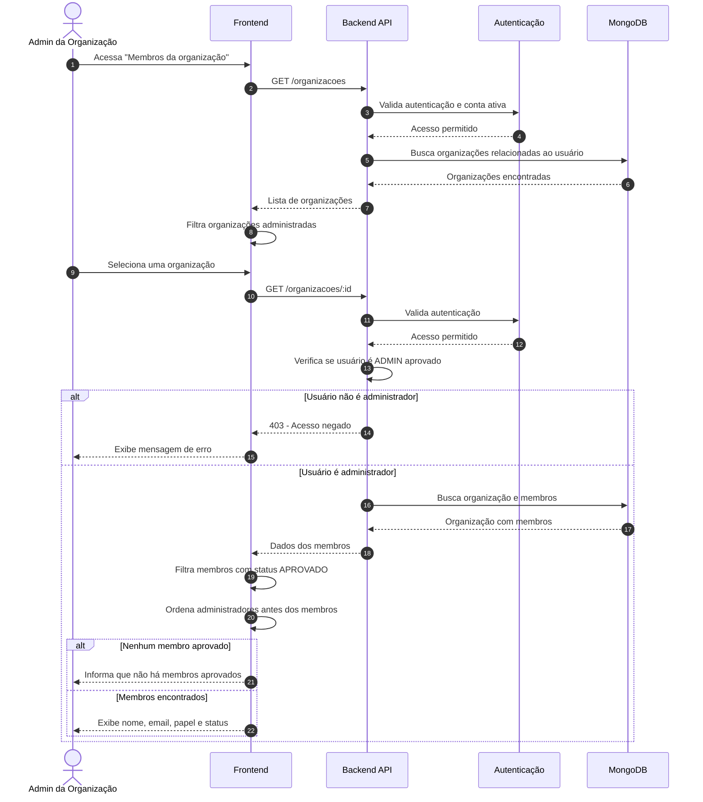
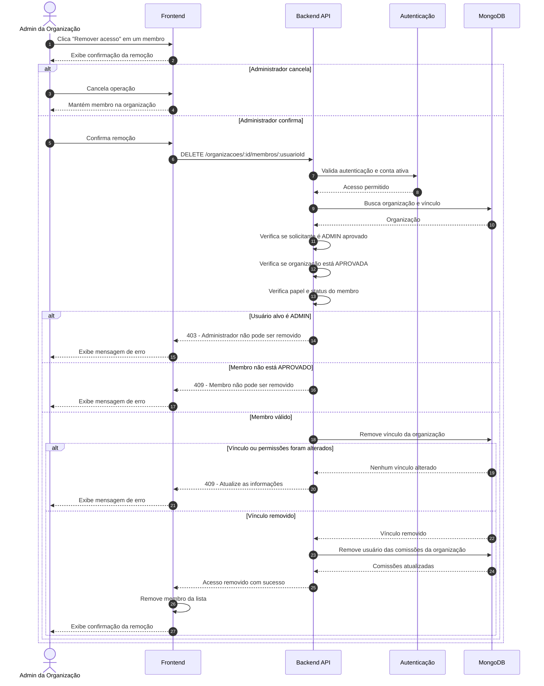

# Diagramas de Sequência - Cadastro e Gestão de Usuários

> **Projeto:** Conecta+  
> **Incremento:** Cadastro de Usuário, Solicitação de Acesso e Gestão de Membros  
> **Formato:** Mermaid (`sequenceDiagram`)  
> **Versão:** 1.0

---

## Relação dos Diagramas

| Requisito | Diagrama |
|---|---|
| RF-01 | Cadastrar-se na plataforma |
| RF-02 | Visualizar organizações disponíveis |
| RF-03 | Solicitar acesso à organização |
| RF-04 | Acompanhar status da solicitação |
| RF-05 | Visualizar solicitações pendentes |
| RF-06 | Aprovar solicitação de acesso |
| RF-07 | Rejeitar solicitação de acesso |
| RF-08 | Visualizar membros da organização |
| RF-09 | Remover membro da organização |

---

# RF-01 - Cadastrar-se na plataforma



---

# RF-02 - Visualizar organizações disponíveis



---

# RF-03 - Solicitar acesso à organização



---

# RF-04 - Acompanhar status da solicitação



---

# RF-05 - Visualizar solicitações pendentes



---

# RF-06 - Aprovar solicitação de acesso



---

# RF-07 - Rejeitar solicitação de acesso



---

# RF-08 - Visualizar membros da organização



---

# RF-09 - Remover membro da organização



---

## Rastreabilidade

Os diagramas de sequência deste documento possuem correspondência direta com os requisitos funcionais definidos para o incremento:

```text
UC1 ↔ RF-01 ↔ Diagrama RF-01
UC2 ↔ RF-02 ↔ Diagrama RF-02
UC3 ↔ RF-03 ↔ Diagrama RF-03
UC4 ↔ RF-04 ↔ Diagrama RF-04
UC5 ↔ RF-05 ↔ Diagrama RF-05
UC6 ↔ RF-06 ↔ Diagrama RF-06
UC7 ↔ RF-07 ↔ Diagrama RF-07
UC8 ↔ RF-08 ↔ Diagrama RF-08
UC9 ↔ RF-09 ↔ Diagrama RF-09
```